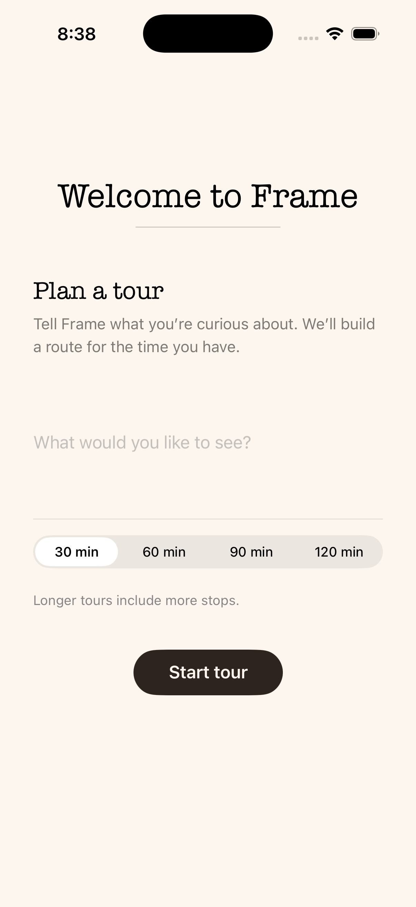

# Frame

<div align="center">

[](https://youtu.be/-S8u6ldT0H0)


</div>

---

Frame is a system for generating personalized, time-bounded museum tours 
at the Yale University Art Gallery (YUAG). With over 200,000 objects in 
its collection and approximately 4,500 on view at any given time, the 
gallery faces the challenge of helping visitors navigate a large and 
diverse set of works within limited time and attention. Frame uses a 
retrieval-augmented generation pipeline grounded in institutional 
collection data. The system harvests IIIF/Linked Art records into a 
PostgreSQL database, generates embeddings for semantic search using 
pgvector, and retrieves relevant objects based on user queries. A FastAPI 
backend then prompts a language model to produce coherent tour narratives 
from the retrieved data. A SwiftUI client presents these tours, 
integrating gallery coordinates to pin recommendations within the 
museum’s physical layout. By combining standardized metadata with 
language models, Frame demonstrates how AI can support scalable, 
personalized interpretation in museum settings without requiring 
extensive curatorial overhead.

## Features

- Natural-language tour requests with a time budget (e.g. 30–120 minutes)
- Semantic retrieval over on-view objects (pgvector + OpenAI embeddings)
- LLM-built tour with titles, order, and gallery hints
- Tour stop cards with images, creator, and location (including case number when available)
- Per-object detail and visitor-framed descriptions
- Floor plan map with pins tied to gallery coordinates
- IIIF / Linked Art harvest from Yale LUX discovery for object metadata and images

## Tech stack

| Area | Technologies |
|------|----------------|
| iOS | Swift, SwiftUI |
| API | Python 3, FastAPI, Uvicorn |
| Data | Supabase (Postgres), pgvector, JSONB (`linked_art_json`) |
| ML / search | OpenAI (chat + `text-embedding-3-small`), semantic search RPC |
| External | Yale LUX / Linked Art discovery & object JSON |

## Installation / setup

**Prerequisites:** Xcode (for FrameUI), Python 3.11+, a Supabase project, OpenAI API access.

**1. Clone and Python environment**

```bash
cd Thesis   # or your clone path
python3 -m venv .venv
source .venv/bin/activate   # Windows: .venv\Scripts\activate
pip install -r backend/requirements.txt
```

**2. Database**

Apply `database/schema.sql` to your Supabase/Postgres instance (SQL editor or migration tool).

**3. Backend environment**

Create `backend/.env` with:

- `OPENAI_API_KEY`
- `SB_URL` — Supabase project URL  
- `SB_SECRET_KEY` — service role key  
- `API_BASE_URL` — e.g. `http://127.0.0.1:8000` for local dev  

**4. Run the API** (from the **repository root**):

```bash
export PYTHONPATH="$PWD"
uvicorn backend.app.api.main:app --reload --port 8000
```

Endpoints: `POST /tour`, `POST /objects/description`, `GET /floor-plans`, `GET /health`. Interactive docs at `http://127.0.0.1:8000/docs`.

**5. iOS app**

Open `FrameUI/FrameUI.xcodeproj` in Xcode. In `FrameUI/FrameUI/Networking/APIClient.swift`, set `APIConfiguration.baseURL` to your API (simulator: `http://127.0.0.1:8000` is typical). Build and run.

**6. Optional data pipeline** (after objects exist in Supabase)

1. `python -m backend.harvest.object_harvest` — optional `--start-page N` to resume  
2. `backend/harvest/import_locations.py` (CSV)  
3. `backend/scripts/populate_galleries.py`  
4. `backend/scripts/import_gallery_coordinates.py`  
5. `backend/harvest/artist_visual_item_harvest.py`  
6. `python -m backend.embeddings.generate_embeddings`  

Linked Art URI/image helpers: `backend/harvest/uri_extractor.py`.

## Project layout

- `FrameUI/` — iOS app (`FrameUI.xcodeproj`)
- `backend/` — FastAPI app, RAG/tour services, harvest, embeddings
- `database/schema.sql` — schema for objects, galleries, floor plans, visual items, vectors
